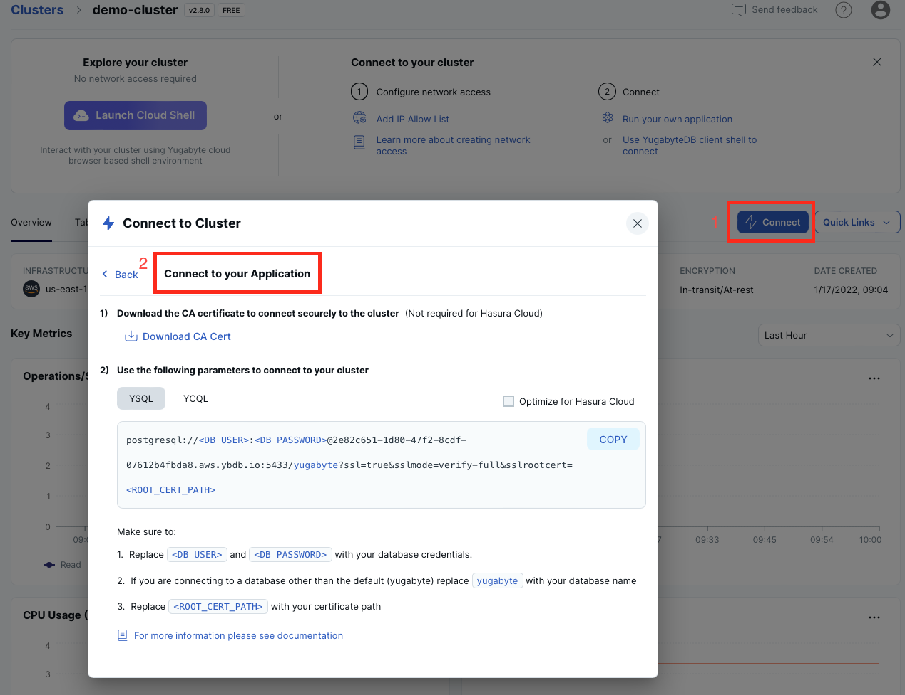

# Simple C++ Application for YugabyteDB

This application connects to your YugabyteDB instance via the 
[libpqxx](http://pqxx.org/development/libpqxx/) driver for PostgreSQL and performs basic SQL 
operations. The instructions below are provided for [YugabyteDB Aeon](https://cloud.yugabyte.com/) deployments. 
If you use a different type of deployment, then update the `sample-app.cpp` file with proper connection parameters.

## Prerequisites

* A 32-bit (x86) or 64-bit (x64) architecture machine. Use [Rosetta](https://support.apple.com/en-us/HT211861) to build and run on Apple silicon.
* gcc 4.1.2 or later, clang 3.4 or later installed.
* OpenSSL 1.1.1 or later (used by libpq and libpqxx to establish secure SSL connections).
* [libpq](https://docs.yugabyte.com/latest/reference/drivers/ysql-client-drivers/#libpq) - the official PostgreSQL driver for C (reused by libpqxx).
* [libpqxx](https://docs.yugabyte.com/latest/reference/drivers/ysql-client-drivers/#libpqxx) - the official PostgreSQL driver for C++.
* Command line tool or your favourite IDE, such as Visual Studio Code.

## Start YugabyteDB Aeon Cluster

* [Start YugabyteDB Aeon](https://docs.yugabyte.com/latest/yugabyte-cloud/cloud-quickstart/qs-add/) instance. You can use
the free tier at no cost.
* Add an IP address of your machine/laptop to the [IP allow list](https://docs.yugabyte.com/latest/yugabyte-cloud/cloud-secure-clusters/add-connections/#manage-ip-allow-lists)

## Clone Application Repository

Clone the repository and change dirs into it:

```bash
git clone https://github.com/YugabyteDB-Samples/yugabyte-simple-cpp-app.git && cd yugabyte-simple-cpp-app
```

## Provide Cluster Connection Parameters

Open the `sample-app.cpp` file and specify the following configuration parameters:
* `HOST` - the hostname of your instance.
* `USER` - the username for your instance.
* `PASSWORD` - the database password.
* `SSL_MODE` - the SSL mode to use. YugabyteDB Aeon requires SSL connections; use `verify-full`.
* `SSL_ROOT_CERT` - a full path to your CA root cert (for example, `/Users/dmagda/certificates/root.crt`). 

Note, you can easily find all the settings on the YugabyteDB Aeon dashboard:



## Run the Application

1. Install the [libpq](https://docs.yugabyte.com/latest/reference/drivers/ysql-client-drivers/#libpq) driver:
    * Homebrew users can install using the `brew install libpq` command (find details [here](https://formulae.brew.sh/formula/libpq)).
    * Others can download the PostgreSQL binaries and source from the [PostgreSQL Downloads](https://www.postgresql.org/download/) page.
2. Install the [libpqxx](https://docs.yugabyte.com/latest/reference/drivers/ysql-client-drivers/#libpqxx) driver:
    * Homebrew users can install using the `brew install libpqxx` command (find details [here](https://formulae.brew.sh/formula/libpqxx)).
    * Others can build the driver using one of the options listed in the [Building libpqxx](https://github.com/jtv/libpqxx#building-libpqxx) section.
    
3. Build the application after replacing `{path-to-libpq}` and `{path-to-libpqxx}` with the paths to the libpq and libpqxx installations (for example, `/usr/local/opt`):
    ```bash
    g++ -std=c++17 sample-app.cpp -o sample-app -lpqxx -lpq \
    -I{path-to-libpq}/libpq/include -I{path-to-libpqxx}/libpqxx/include \
    -L{path-to-libpq}/libpq/lib -L{path-to-libpqxx}/libpqxx/lib 
    ```
4. Run the application:
    ```bash
    ./sample-app
    ```

Upon successful execution, you will see output similar to the following:

```bash
>>>> Connecting to YugabyteDB!
>>>> Successfully connected to YugabyteDB!
>>>> Successfully created table DemoAccount.
>>>> Selecting accounts:
name=Jessica, age=28, country=USA, balance=10000
name=John, age=28, country=Canada, balance=9000
>>>> Transferred 800 between accounts.
>>>> Selecting accounts:
name=Jessica, age=28, country=USA, balance=9200
name=John, age=28, country=Canada, balance=9800
```

## Explore Application Logic

Congrats! You've successfully executed a simple C++ app that works with YugabyteDB.

Now, explore the source code of `sample-app.cpp`:
1. `connect` function - establishes a connection with your cloud instance via the libpqxx driver.
2. `createDatabase` function - creates a table and populates it with sample data.
3. `selectAccounts` function - queries the data with SQL `SELECT` statements.
4. `transferMoneyBetweenAccounts` function - updates records consistently with distributed transactions.

## Questions or Issues?

Having issues running this application or want to learn more from Yugabyte experts?

Join [our Slack channel](https://communityinviter.com/apps/yugabyte-db/register),
or raise a question on StackOverflow and tag the question with `yugabytedb`!
